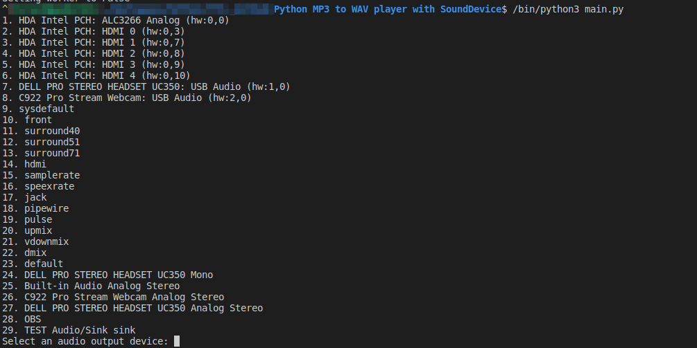

# Audio Playback with Python

This Python script allows you to play an audio file using the `sounddevice` and `soundfile` libraries. The user can select the audio output device to use and the script will automatically convert the audio file to the appropriate format and samplerate.

## Requirements

This project requires Python 3.x and the following libraries:

- `sounddevice`
- `soundfile`
- `pydub`

You can install these libraries using `pip`:
```
pip install -r requirements.txt
```

## Usage

1. Place the audio file you want to play in the same directory as the `main.py` script.
2. Run the `main.py` script using the following command:
```
python main.py
```
. Follow the on-screen prompts to select an audio output device and start playing the audio.


## License

This project is licensed under the MIT License - see the [LICENSE](https://www.mit.edu/~amini/LICENSE.md) for details.

## Special Thanks

This project was inspired by the Twitch channel of [Prof. Andrea Pollini](https://www.twitch.tv/profandreapollini) and the supportive Twitch community. Thanks to their encouragement and feedback.
